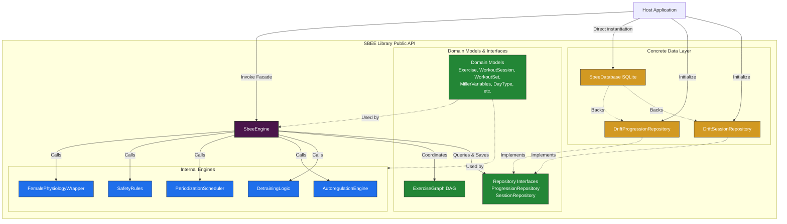

# SBEE Architecture

Welcome to the Science-Based Exercise Engine (SBEE) Architecture Guide. This document details the high-level design, architectural patterns, component layouts, and data flow of the SBEE library. It is designed to serve both future maintainers of the engine and host application developers seeking a deep understanding of its internal mechanics.

---

## 1. Design Philosophy

SBEE is built as a **pure-Dart library** focused on resistance training prescription, scheduling, and autoregulation. Its design is governed by the following core principles:

1. **Decoupled Core Logic**: The core mathematical rules of periodization, safety gates, and autoregulation are completely independent of any UI or environment specifics. This ensures the library remains portable, fast, and easily testable.
2. **Deterministic & Safe**: Progression rules, such as Kenneth Miller's 5-variable progression sequence and push-to-pull ratios, are strictly validated. Biomechanical safety invariants are enforced at the type level where possible, and guarded by assertions.
3. **Graph-Driven Tiering**: Exercise progressions are modeled as a Directed Acyclic Graph (DAG). This approach avoids circular progression traps and allows logical, step-by-step scaling of exercises.
4. **Adaptive Customizations**: Physiological adaptations (such as menstrual cycle day offsets or age-specific set volume overrides) pre-process input parameters before they enter the core logic, or decorate output results. This isolates host-specific or population-specific logic from the primary engine.

---

## 2. High-Level Component Layout

SBEE is divided into three distinct layers:
1. **Public Facade (`SbeeEngine`)**: The single orchestrator entry point that coordinates data retrieval, applies safety gates, invokes the scheduler, and returns workout models.
2. **Domain Layer**: Contains immutable, rich domain models (`Exercise`, `WorkoutSession`, `WorkoutSet`, `MillerVariables`) and interfaces for data persistence (`ProgressionRepository`, `SessionRepository`).
3. **Engine Core**: Internal, pure-logic components that implement specific rules (Autoregulation, Safety Rules, Scheduler, Detraining Logic).

The diagram below shows the component relationships and boundaries:



---

## 3. Core Architectural Patterns

### A. Pre-processing & Decorator Pattern for Physiology
To prevent the core safety-tested engine logic from becoming cluttered with population-specific heuristics, SBEE employs a **Pre-processing / Decorator** pattern implemented in [FemalePhysiologyWrapper](../lib/src/engine/female_wrapper.dart).

- **Pre-processing**: Adjusts inputs (such as decreasing target RPE during early follicular phases or capping target RPE/rest intervals) before they are sent to the core progression calculation.
- **Decoration**: Appends pelvic stability and safety cues onto generated workout sets, or overrides general intensity metric descriptions (e.g. converting 1RM to RIR for older adults) on top of the standard outputs.

This encapsulation ensures that if a new wrapper (e.g. for youth athletics or diabetic populations) is added in the future, it can be written as a separate pre-processing filter without modifying the core state changes in [SbeeEngine](../lib/src/sbee_engine.dart).

```
   [Host Application]
          │
          ▼  (FemaleProfile supplied)
 ┌────────────────────────────────────────┐
 │        FemalePhysiologyWrapper         │  ◄── Pre-processes inputs
 └───────────────────┬────────────────────┘
                     │ (Adjusted targetRpe)
                     ▼
 ┌────────────────────────────────────────┐
 │        AutoregulationEngine            │  ◄── Core engine executes standard math
 └───────────────────┬────────────────────┘
                     │ (New MillerVariables)
                     ▼
 ┌────────────────────────────────────────┐
 │        FemalePhysiologyWrapper         │  ◄── Decorates outputs (Adds safety cues, offsets)
 └───────────────────┬────────────────────┘
                     │
                     ▼
             [Final WorkoutSet]
```

### B. Finite State Machine (FSM) Workout Session Tracking
Workout session execution transitions are non-linear but highly constrained. To prevent invalid states (such as resting before a set starts, or jumping from a warm-up directly to a cool-down), SBEE maps workout sessions to a formal Finite State Machine (FSM) using the [SessionStateMachine](../lib/src/engine/session_state_machine.dart) class:

- **States**: `warmUp` ➔ `activeSet` ➔ `rest` ➔ `coolDown` ➔ `completed`.
- **Transitions**:
  - `startWorkout()`: `warmUp` ➔ `activeSet`
  - `completeSet()`: `activeSet` ➔ `rest`
  - `startNextSet()`: `rest` ➔ `activeSet`
  - `completeWorkout()`: `activeSet` or `rest` ➔ `coolDown`
  - `finishSession()`: `coolDown` ➔ `completed`

This state transition logic is strictly isolated from UI rendering and exposed through a reactive stream.

### D. Postural Balance Generation Enforcement
To ensure musculoskeletal health and postural alignment, SBEE enforces a strict 2:1 pull-to-push set ratio over a sliding 14-day window during workout generation:

- **2:1 Ratio Validation**: The engine queries the 14-day history of completed sets and sums it with the new candidate session sets. A pushing exercise is only selected if:
  $$H_{\text{pull}} + N_{\text{pull}} \ge 2 \times (H_{\text{push}} + N_{\text{push}} + \text{setsCount})$$
  Where $H$ represents historical sets and $N$ represents newly proposed sets in the session. Pushing exercises are shuffled and evaluated sequentially.
- **Fallback Rule**: If no pulling exercises are available in the candidate pool but pushing exercises are present, the engine bypasses the push-limiting safety rule to generate pushing exercises anyway. In this scenario, it flags a `posturalWarning` on the session with `PosturalWarningReason.noPullingAvailable`.
- **Historical Deficits**: If the combined sets do not satisfy the 2:1 ratio (due to an uncorrectable historical deficit where no new pushes can be generated or during the fallback), the session is marked with `PosturalWarningReason.historicalDeficit`.
- **Scaling Considerations**: Unconditionally including all pulling and other exercises in the final workout session are known scaling points, which may require introducing size limits or exercise caps for larger exercise catalogs in the future.

---

## 4. Persistence Architecture

SBEE relies on **Drift** (a reactive persistence library for Dart/Flutter backed by SQLite) to maintain persistent state. The schema is organized into four main tables:

1. **`DriftWorkoutSessions`**: Persists metadata for generated and completed sessions (start time, completion status, day type).
2. **`DriftWorkoutSets`**: Persists log details for every individual set, including reps completed, target RPE, reported RPE, rest duration, corrective cues, and the specific Kenneth Miller variables applied during that set.
3. **`DriftExerciseProgressions`**: Tracks the user's current progress parameters (Miller variables) and competency levels for each individual exercise ID.
4. **`DriftStatusAchieved`**: Tracks milestone dates (e.g. the date the user achieved 'Intermediate' status) which are used to unlock advanced features like slow-tempo variations.

Repositories enforce transactional integrity and convert between Drift's auto-generated data objects and SBEE's pure domain models.
